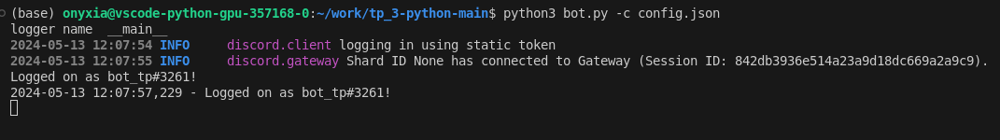

## Fonctionnement du Bot
Le bot va utiliser un LLM pour répondre à un prompt.
### Commandes
- `!help` : Liste de commandes supportées par le bot. 
- `!prompt <message>` :  Génère une réponse au message en utilisant Llama2.
- `!ping` : Le bot va répondre avec "Pong!"

### Ollama
[Ollama](https://ollama.com/) est un service pour faire tourner localement un LLM de notre choix, dans notre cas il s'agit de Llama2.

## Installation 

Certains prérequis sont nécessaires pour mettre en marche le bot : 

- Télécharger ollama: [https://ollama.com/](https://ollama.com/)
- Lancer Llama2 avec :  `ollama run llama2`
- (Optionel) Si un message d'erreur apparait, faire dans un autre terminal : `ollama serve` avant de lancer Llama 2

installez les dépendances pythons :  
`pip install -r requirements.txt`

Enfin, renseignez le token du bot dans **config.json**

## Lancement 
Lancez le bot avec la commande : 
`python3 bot.py -c config.json`

## Execution du code
Lancement du bot via CLI : 

Utilisation des commandes depuis un serveur Discord : 

